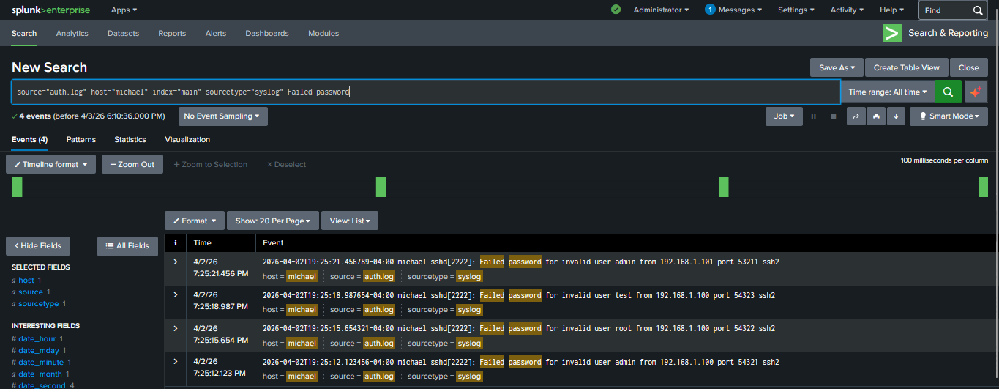
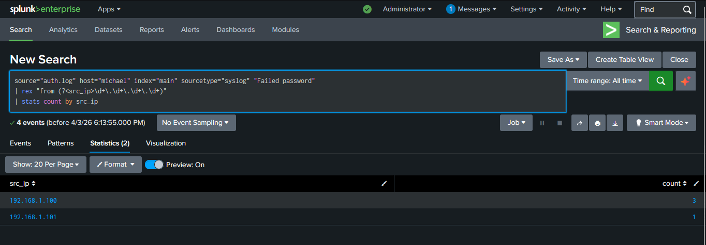
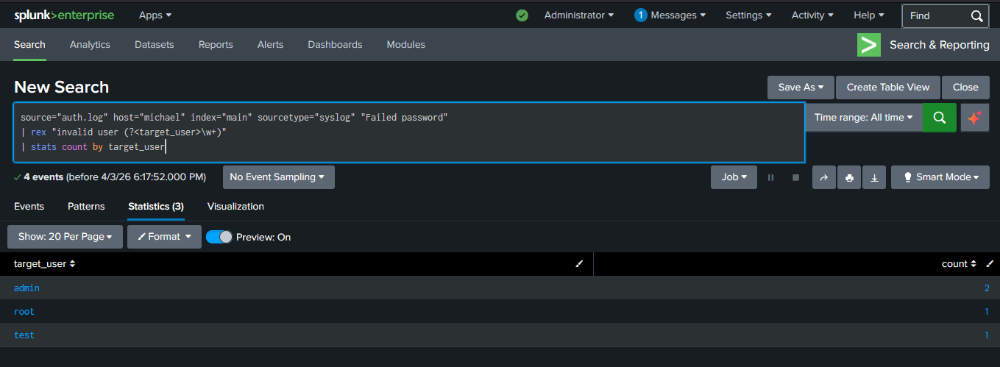
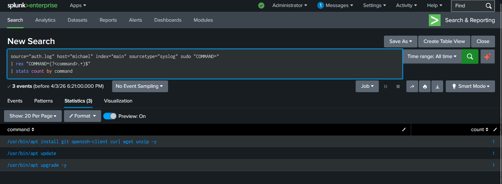

# Security Monitoring & Log Analysis Lab

## Overview
This project demonstrates basic security monitoring and log analysis techniques using a simulated environment. The goal is to identify suspicious activity and understand how security events appear in system and network logs.

## Objectives
- Analyze system and network logs
- Identify failed login attempts and suspicious behavior
- Apply SIEM concepts such as event correlation and detection
- Understand indicators of compromise (IOCs)

## Tools Used
- Splunk 
- Linux (Ubuntu / Kali)
- Sample system and network logs

## Key Activities
- Ingested and reviewed log data
- Created queries to identify failed login attempts and abnormal activity
- Correlated events across logs to detect suspicious behavior
- Investigated potential security incidents based on log evidence

## Project Structure
- `/logs` – Sample log files used for analysis  
- `/queries` – Search queries used to detect events  
- `/screenshots` – Evidence of analysis and findings  

## SIEM Setup

Splunk Enterprise was installed locally and used to ingest authentication logs for analysis. The logs were uploaded via the Splunk "Add Data" interface and indexed for querying.

## SIEM Analysis (Splunk)

Authentication logs were ingested into Splunk Enterprise to simulate real-world Security Operations Center (SOC) monitoring and detection workflows. Analysis focused on identifying failed login attempts, correlating attack patterns, and detecting privilege escalation activity.

### Failed Login Events (Initial Detection)
The following search identifies failed authentication attempts within the dataset.

```spl
"Failed password"
```



### Failed Login Summary by Source IP
This query extracts source IP addresses and aggregates failed login attempts to identify potential attack sources.

```spl
"Failed password"
| rex "from (?<src_ip>\d+\.\d+\.\d+\.\d+)"
| stats count by src_ip
```



### Failed Login Summary by Targeted Username
This query extracts targeted usernames and aggregates failed login attempts to identify which accounts are being targeted.

```spl
"Failed password"
| rex "invalid user (?<target_user>\w+)"
| stats count by target_user
```



### Sudo Command Summary (Privilege Escalation)
This query extracts and summarizes commands executed with elevated privileges, providing visibility into administrative activity.

```spl
sudo "COMMAND="
| rex "COMMAND=(?<command>.+)$"
| stats count by command
```



## Outcome
This lab demonstrates foundational skills in security monitoring, log analysis, and threat detection, which are essential for SOC analyst and entry-level cybersecurity roles.
