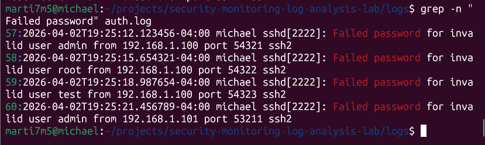
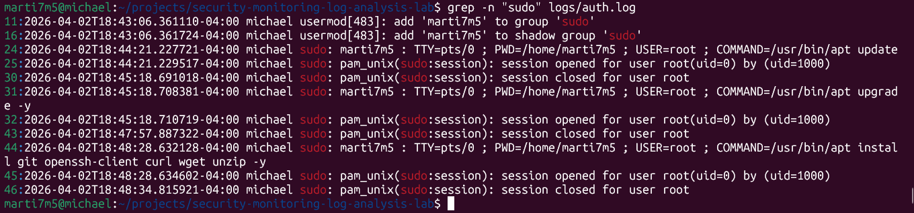

# Security Monitoring & Log Analysis Lab

## Overview
This project demonstrates basic security monitoring and log analysis techniques using a simulated environment. The goal is to identify suspicious activity and understand how security events appear in system and network logs.

## Objectives
- Analyze system and network logs
- Identify failed login attempts and suspicious behavior
- Apply SIEM concepts such as event correlation and detection
- Understand indicators of compromise (IOCs)

## Tools Used
- Splunk 
- Linux (Ubuntu / Kali)
- Sample system and network logs

## Key Activities
- Ingested and reviewed log data
- Created queries to identify failed login attempts and abnormal activity
- Correlated events across logs to detect suspicious behavior
- Investigated potential security incidents based on log evidence

## Project Structure
- `/logs` – Sample log files used for analysis  
- `/queries` – Search queries used to detect events  
- `/screenshots` – Evidence of analysis and findings  

## SIEM Setup

Splunk Enterprise was installed locally and used to ingest authentication logs for analysis. The logs were uploaded via the Splunk "Add Data" interface and indexed for querying.

## Evidence

### Failed Login Attempts (Brute Force Simulation)

The following output shows multiple failed authentication attempts targeting different usernames from the same source IP, indicating potential brute-force activity.

### Privilege Escalation Activity

The following log entries show the user executing commands with elevated privileges using sudo, indicating privilege escalation.

## Outcome
This lab demonstrates foundational skills in security monitoring, log analysis, and threat detection, which are essential for SOC analyst and entry-level cybersecurity roles.
